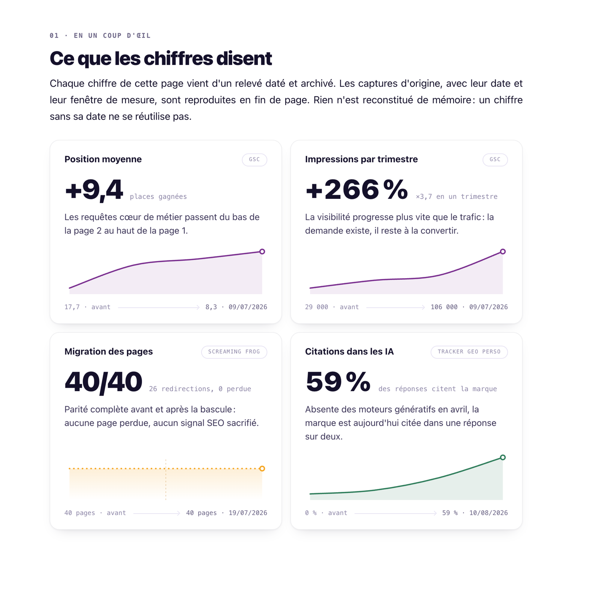
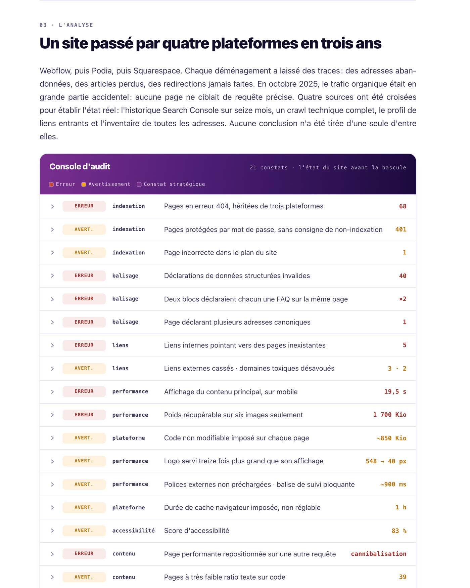
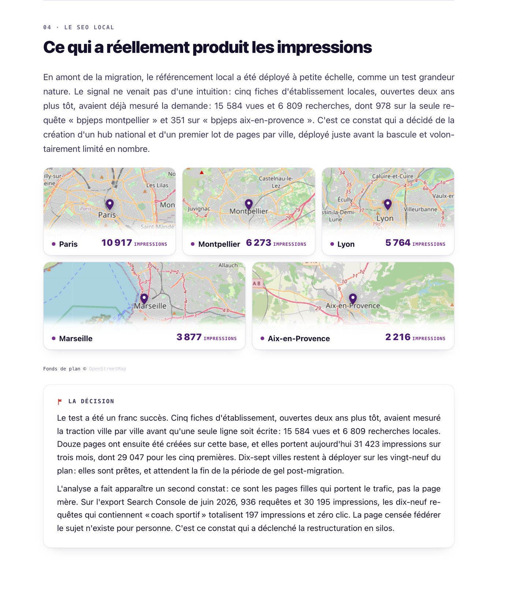
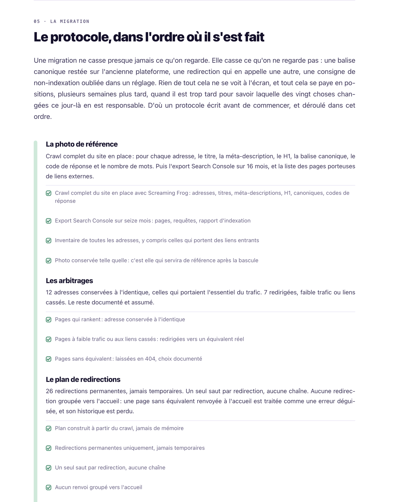

# Migration et restructuration SEO d'un site de formation

Étude de cas d'un chantier de onze mois : refonte de l'architecture en silos, migration complète
du site, SEO local, et suivi de la visibilité dans les moteurs génératifs.

### **[Lire l'étude de cas](https://marionbuilds.github.io/etude-de-cas-seo/)**

## Les résultats

| Ce qui a été mesuré | Avant | Après |
|---|---|---|
| Impressions par trimestre | 29 000 | 106 000, soit +266 % |
| Position moyenne | 17,7 | 8,3, soit +9,4 places gagnées |
| Pages au crawl de parité | 40 | 40, avec 26 redirections et aucune page perdue |
| Réponses d'IA qui citent la marque | 0 % | 59 % |

Chaque chiffre porte sa source et sa date de relevé. Les captures d'origine, avec leur fenêtre
de mesure, sont reproduites en fin de page. Un chiffre sans sa date ne se réutilise pas.

## La structure de la page

La page se lit dans l'ordre du chantier : l'état de départ, ce qui a été décidé, comment
la bascule a été conduite, puis ce que les relevés disent.

**01 · En un coup d'œil.** Les quatre indicateurs, chacun avec l'outil qui l'a produit
et la date du relevé.

**02 · Le déroulé.** Quatre temps qui ne se mélangent pas : éditorial et local, migration,
gel, restructuration.

**03 · L'analyse.** Un site passé par quatre plateformes en trois ans. Les 21 constats de
l'audit de départ, classés par gravité et par domaine, chacun dépliable sur son détail.

**04 · Le SEO local.** Cinq fiches d'établissement ouvertes deux ans plus tôt avaient déjà
mesuré la demande ville par ville. C'est ce constat qui a décidé de la création des pages
locales, pas une intuition.

**05 · La migration.** Le protocole écrit avant de commencer, et déroulé dans cet ordre :
la photo de référence, les arbitrages, le plan de redirections, la bascule, le contrôle de parité.

**Lire les chiffres.** Comment distinguer un vrai problème d'un faux après une bascule, et
le seuil de retour arrière fixé avant de regarder les données.

**06 · Visibilité dans les LLM.** Le SEO vise le trafic, le GEO vise la mention. Le taux de
citation est relevé avec un tracker maison : [iametre](https://github.com/marionbuilds/iametre).

**07 · Le regard de Googlebot.** La migration vue depuis les statistiques d'exploration
de la Search Console : le pic de recrawl du jour de la bascule, une demande de crawl
durablement doublée depuis, puis les quatre blocs du rapport interprétés un par un :
par réponse, par objectif, par type de Googlebot, par type de fichier. 115 lignes de 404
analysées, quatre motifs, une seule action retenue.

**08 · Les performances.** De 19,5 secondes à 1,3 seconde d'affichage sur mobile.

**09 · Ce qui vient ensuite.** Le plan de restructuration en silos, construit à partir de
936 requêtes réelles.

**10 · Les annexes.** Les relevés datés du projet, en capture d'origine.

## La page elle-même

Un seul fichier HTML, écrit pour ce projet.

- aucune dépendance, aucun script tiers, aucune police distante, aucun appel réseau
- bilingue français et anglais, avec bascule instantanée
- sommaire qui suit la lecture, et menu déroulant sur téléphone
- graphiques et schémas en SVG, tracés à partir des relevés
- visionneuse pour les captures d'annexes
- responsive complet, du téléphone au grand écran

## À propos

Page statique, non indexée, hébergée sur GitHub Pages.

---

# SEO migration and site restructuring for a training company

Case study of an eleven month project: silo architecture, a full site migration, local SEO,
and tracking of brand visibility inside generative engines.

### **[Read the case study](https://marionbuilds.github.io/etude-de-cas-seo/)**

| What was measured | Before | After |
|---|---|---|
| Impressions per quarter | 29,000 | 106,000, up 266% |
| Average position | 17.7 | 8.3, up 9.4 positions |
| Pages in the parity crawl | 40 | 40, with 26 redirects and no page lost |
| AI answers citing the brand | 0% | 59% |

Every figure carries its source and reading date. The original screenshots are reproduced
at the end of the page.

The page reads in the order of the project: the starting audit and its 21 findings, the local
SEO call, the migration protocol written before anything moved, what the readings said after
the switch, brand visibility inside generative engines, the migration as Googlebot saw it in
the Search Console crawl stats, and the silo plan that comes next.

It is a single HTML file with no dependency, no third party script and no network call,
bilingual, fully responsive, with every chart drawn in SVG from the actual readings.
