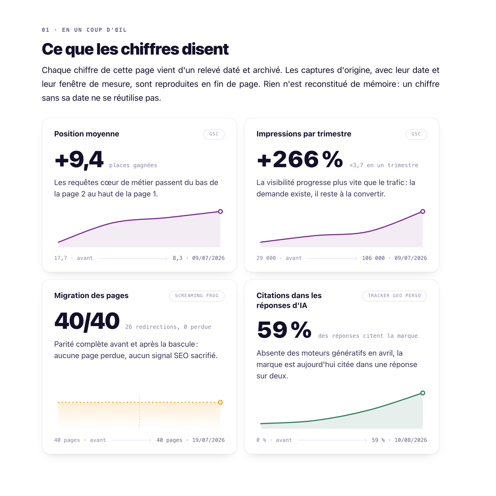
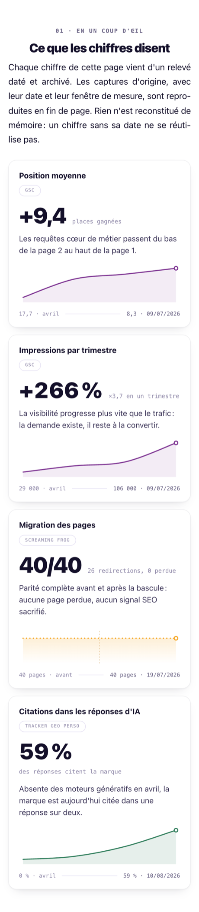

# Migration et restructuration SEO d'un site de formation

Étude de cas d'un chantier de onze mois : refonte de l'architecture en silos, migration complète du site,
SEO local, et suivi de la visibilité dans les moteurs génératifs.

### **[Lire l'étude de cas](https://marionbuilds.github.io/etude-de-cas-seo/)**

## Les résultats

| Ce qui a été mesuré | Avant | Après |
|---|---|---|
| Impressions par trimestre | 29 000 | 106 000, soit +266 % |
| Position moyenne | 17,7 | 8,3, soit +9,4 places gagnées |
| Pages au crawl de parité | 40 | 40, avec 26 redirections et aucune page perdue |
| Réponses d'IA qui citent la marque | 0 % | 59 % |

Chaque chiffre porte sa source et sa date de relevé. Les captures d'origine, avec leur fenêtre
de mesure, sont reproduites en fin de page. Un chiffre sans sa date ne se réutilise pas.

## Ce que couvre l'étude de cas

- l'audit de départ et ses 21 constats
- l'arbitrage sur le SEO local, sur cinq villes
- le protocole de migration en sept étapes, avec le seuil de retour arrière fixé avant de regarder les chiffres
- la mesure après la bascule, et ce que les chiffres ne disent pas
- la visibilité dans les moteurs génératifs, relevée avec un tracker maison :
  [iametre](https://github.com/marionbuilds/iametre)

## La page elle-même

La page est un seul fichier HTML, écrit pour ce projet et sans rien emprunter à personne.

- aucune dépendance, aucun script tiers, aucune police distante, aucun appel réseau
- bilingue français et anglais, avec bascule instantanée
- sommaire qui suit la lecture, et menu déroulant sur téléphone
- graphiques et schémas en SVG, tracés à partir des relevés
- visionneuse pour les captures d'annexes
- responsive complet, du téléphone au grand écran

## À propos

Page statique, non indexée, hébergée sur GitHub Pages.

---

# SEO migration and site restructuring for a training company

Case study of an eleven month project: silo architecture, a full site migration, local SEO,
and tracking of brand visibility inside generative engines.

### **[Read the case study](https://marionbuilds.github.io/etude-de-cas-seo/)**

| What was measured | Before | After |
|---|---|---|
| Impressions per quarter | 29,000 | 106,000, up 266% |
| Average position | 17.7 | 8.3, up 9.4 positions |
| Pages in the parity crawl | 40 | 40, with 26 redirects and no page lost |
| AI answers citing the brand | 0% | 59% |

Every figure carries its source and reading date. The original screenshots are reproduced
at the end of the page.

The page is a single HTML file with no dependency, no third party script and no network call,
bilingual, fully responsive, with every chart drawn in SVG from the actual readings.
